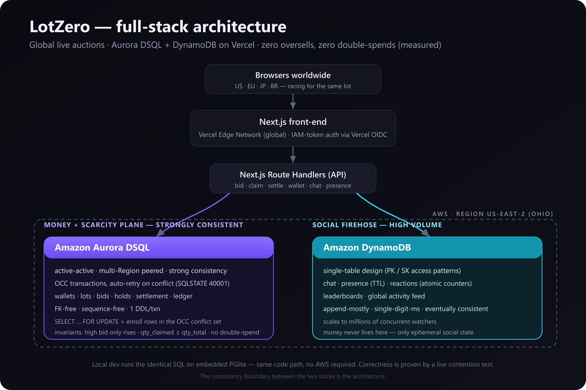
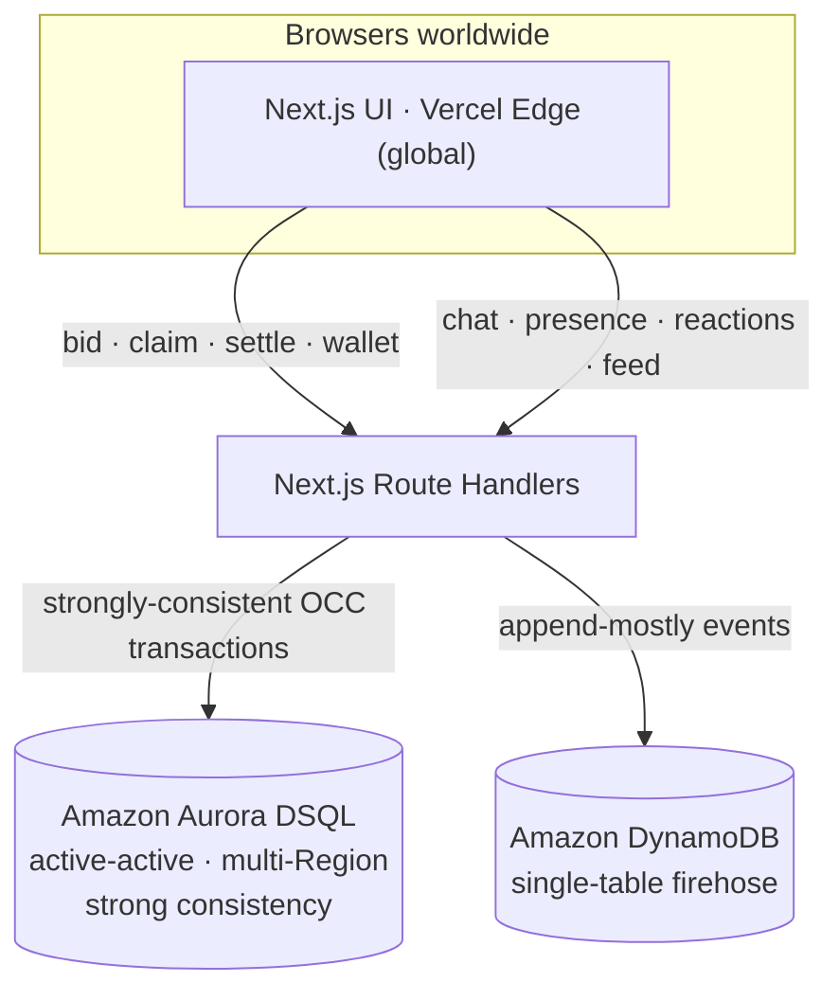

# LotZero

**Global live auctions with zero oversells and zero double-spends.**

A real-time, worldwide auction marketplace where the money lives on **Amazon Aurora DSQL**
(active-active, strongly consistent) and the social firehose lives on **Amazon DynamoDB**,
fronted by a **Next.js** app deployed on **Vercel**.

Built for the **H0: Hack the Zero** hackathon · Track 3 (Million-scale global app).

> **Uniqueness claim:** A global live marketplace where the authoritative bid ledger and
> money movement run on Aurora DSQL's active-active strong consistency, while the
> million-scale social firehose runs on DynamoDB — with a measured **zero oversells and
> zero double-spends under concurrent multi-Region load**. No generic store on the stack
> can make that guarantee.

---

## The insight (why this needs *this* stack)

Real-time global commerce used to force a choice:

- **Correctness** — a single-Region SQL box. Strongly consistent, but every distant bidder
  pays a latency tax and it's a single point of failure.
- **Scale** — an eventually-consistent multi-Region NoSQL store. Fast everywhere, but it
  *cannot safely hold money*: two Regions can both accept "the last unit," and conflict
  resolution silently loses writes.

**Aurora DSQL collapses that tradeoff.** It gives active-active, multi-Region **strong
consistency** with low-latency local writes. So the part that must be exactly right — the
bid ledger, wallet holds, settlement — becomes an ordinary strongly-consistent CRUD app,
and we pair it with DynamoDB for the part that just needs to be fast and huge.

**That consistency boundary is the architecture.**

| Plane | Store | Data | Why this store |
|---|---|---|---|
| Money + scarcity | **Aurora DSQL** | wallets, lots, bids, ledger, settlement | Must be exactly right under global contention. OCC + strong consistency = no oversell, no double-spend, no lost writes. |
| Social firehose | **DynamoDB** | chat, presence, reactions, leaderboards, activity feed | Append-mostly, millions of writes, single-digit-ms; eventually consistent is fine. Single-table design. |

---

## Architecture





Auth to DSQL uses short-lived IAM tokens minted by
`@aws/aurora-dsql-node-postgres-connector` (works with Vercel OIDC — no static DB password).

---

## The invariants (and how DSQL enforces them)

All money operations run inside `db.tx()`, which on Aurora DSQL is a strongly-consistent
transaction using **optimistic concurrency control**: conflicting transactions fail with an
OCC error and are automatically retried, re-checking fresh state.

1. **A lot's high bid only ever increases; there is exactly one high bidder.**
2. **`qty_claimed` never exceeds `qty_total`** → zero oversells, globally.
3. **A wallet's held + spent never exceeds its funded balance** → zero double-spends, even
   when the same user acts from two Regions in the same millisecond.

DSQL-aware data modeling (see [`src/lib/db/schema.ts`](src/lib/db/schema.ts)):
- **No foreign keys** (DSQL doesn't support them) — integrity is enforced in the transactions.
- **No sequences / `SERIAL`** — IDs are application-generated.
- **No JSON/JSONB columns** — DSQL doesn't support JSON types.
- **One DDL statement per transaction** — the client applies each `CREATE TABLE` separately.
- **`SELECT … FOR UPDATE`** is used as DSQL intends it: not a lock, but a way to enroll the
  read rows into the OCC conflict-check set, so a racing writer loses cleanly at commit.
- **Async indexes** are applied out-of-band ([`infra/dsql-indexes.sql`](infra/dsql-indexes.sql)).

The core logic lives in [`src/lib/domain/bids.ts`](src/lib/domain/bids.ts).

---

## The proof (measured correctness, not just "it works")

The `/proof` page and the `loadtest` script fire a deliberate global race — many buyers
across five AWS Regions colliding on a scarce lot at the same instant — and verify the
invariant holds exactly. Sample run (local, PGlite):

```
scenario       conc  winners  oversell  dblspend  ms     mode    result
oversell       50    1        0         0         185    pglite  ✅ held
oversell       100   3        0         0         358    pglite  ✅ held
oversell       200   10       0         0         866    pglite  ✅ held
double_spend   50    1        0         0         258    pglite  ✅ held
double_spend   150   1        0         0         690    pglite  ✅ held
```

- **oversell** — N buyers worldwide rush a drop with only K units. Exactly K win; the rest
  are cleanly rejected; the seller is credited exactly K × price.
- **double_spend** — one buyer funded for a single purchase tries to win N lots at once from
  many Regions. Exactly one wins; their balance never goes negative.

Run it yourself against a live server:

```bash
npm run loadtest                                   # vs http://localhost:3000
BASE_URL=https://your-app.vercel.app npm run loadtest
```

It exits non-zero if any invariant is ever violated, so it doubles as a CI gate.

> On local PGlite the transactions serialize, so the race is simulated and the invariant is
> enforced by the same SQL. On **Aurora DSQL** the attempts run with true multi-Region
> concurrency and the losing transactions hit a real OCC conflict and retry — identical
> guarantee, real contention.

---

## Quickstart (zero setup)

```bash
npm install
npm run dev      # http://localhost:3000
```

With no environment variables set, LotZero runs entirely locally:
- the SQL ledger uses **PGlite** (embedded Postgres) running the *identical* SQL it runs on
  Aurora DSQL, auto-seeded with demo lots and funded wallets;
- the firehose uses an in-process store.

Switch identity and acting Region from the top-right of the header, open a lot, and bid.
Open the same lot in two tabs as two users in two Regions to feel the contention.

### Going to real AWS

Set `DSQL_CLUSTER_ENDPOINT` to move the ledger onto Aurora DSQL, and `DYNAMODB_TABLE` to
move the firehose onto DynamoDB. Full steps in [`infra/PROVISION.md`](infra/PROVISION.md).
Nothing else in the app changes — same code, same SQL.

---

## Auction mechanics

- **English (ascending)** — classic high-bid auction. Funds are *held* on the high bidder
  and released the instant they're outbid; settlement converts the hold into payment.
- **Dutch (falling price)** — the price ticks down on a schedule; the first claim anywhere on
  Earth wins. The hardest possible contention test, and the most dramatic demo.
- **Fixed drop** — a hard-capped, fixed-price global drop (e.g. 50 units). Proves no
  overselling at multi-unit scale.

---

## How this maps to the judging criteria

- **Technological Implementation** — a deliberate two-store architecture with an explicit
  consistency boundary; DSQL-correct data modeling (FK-free, sequence-free, OCC retry,
  async indexes); the official IAM connector; measured correctness under load.
- **Design** — the front-end is built around the back-end: live price/countdown, held-funds
  surfaced in the wallet, Region-aware actions, and a proof console that makes the database
  guarantee *visible*.
- **Impact & Real-world Applicability** — live commerce is a real, growing market; this is a
  genuinely shippable marketplace whose correctness is the product.
- **Originality** — the genuine insight that Aurora DSQL turns a previously-impossible
  weekend build (globally-consistent contention) into a CRUD app, proven, not asserted.

## Impact

Live commerce is large and growing fast, and the two failure modes LotZero removes —
**overselling** and **global latency** — are both quantifiably expensive.

- **Big, fast-growing market.** US livestream shopping reached roughly **$50B** in GMV in 2025
  and is projected to exceed **5% of US digital commerce** in 2026. The global live-commerce
  market was about **$172B in 2025**, growing at a **~41% CAGR**.
- **Overselling is a real, costly failure.** Cart/checkout abandonment averages **~70%**, which
  Baymard estimates at **~$260B/yr of recoverable revenue in the US** alone. Overselling a
  limited drop turns a completed sale into a cancellation, refund, and a lost customer — the
  exact failure LotZero makes *structurally impossible*.
- **Global latency directly costs conversion.** Amazon found every **100ms** of added latency
  cost **~1% of sales**; Akamai measured roughly a **7% conversion drop per 100ms**; and
  Google/Deloitte's *Milliseconds Make Millions* found a **0.1s speedup lifted retail
  conversion ~8%**. A single-Region database taxes every distant buyer with this latency;
  Aurora DSQL's active-active local writes remove it *while staying strongly consistent*.

LotZero is the rare design that fixes both at once: correctness (no oversell/double-spend) and
low-latency local writes everywhere, on one operationally proven stack.

Sources: live commerce — [Statista](https://www.statista.com/topics/8752/livestream-commerce/),
[Grand View Research](https://www.grandviewresearch.com/industry-analysis/live-commerce-market-report);
abandonment — [Baymard Institute](https://baymard.com/lists/cart-abandonment-rate);
latency — [Amazon/Conductor](https://www.conductor.com/academy/page-speed-resources/faq/amazon-page-speed-study/),
Akamai, [Google × Deloitte, *Milliseconds Make Millions*](https://www.deloitte.com/uk/en/Industries/consumer/research/milliseconds-make-millions.html).
*Re-confirm each figure against the primary source before final submission.*

## Honest limitations / path to production

- Payments are **sandboxed** (demo wallets), not a real PSP; production needs Stripe/Adyen,
  KYC, and tax.
- No auth provider yet — identity is a demo switcher; production needs real accounts/authz.
- Anti-fraud, bid-sniping protection, and dispute handling are out of scope.
- Aurora DSQL has documented SQL/feature limits; the schema respects the big ones (no FK, no
  sequences), but a production schema review against the current DSQL feature set is required.
- The firehose currently polls; production would use WebSockets/SSE and DynamoDB Streams.

## Tech stack

Next.js 16 (App Router) · React 19 · TypeScript · Tailwind v4 · Aurora DSQL via `pg` +
`@aws/aurora-dsql-node-postgres-connector` · DynamoDB via AWS SDK v3 · PGlite for local dev ·
Vercel.

## Project map

- [`src/lib/db/`](src/lib/db/) — DSQL/PGlite client, schema, seed
- [`src/lib/domain/`](src/lib/domain/) — bids, wallet, settlement, pricing, the proof
- [`src/lib/dynamo/`](src/lib/dynamo/) — the single-table firehose
- [`src/app/api/`](src/app/api/) — route handlers
- [`src/app/proof/`](src/app/proof/) — the contention-proof console
- [`infra/`](infra/) — provisioning, DSQL indexes, DynamoDB table
